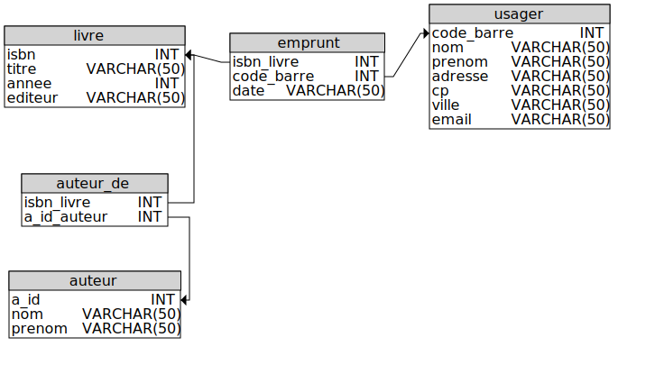

# TP1 : interroger une base de données: requêtes simples
Pour commencer, [ouvrir dans Basthon le notebook exemple]((https://notebook.basthon.fr/?from=https://raw.githubusercontent.com/thfruchart/tnsi/main/03/exemple.ipynb&module=https://raw.githubusercontent.com/thfruchart/tnsi/main/03/livres.sql)).

Pour découvrir l'utilisation d'une base de données, vous allez **saisir des requêtes** : pour cela, il suffit de copier-coller le code de la requête dans une cellule de code du notebook. La mise en forme suivante sera utilisée pour les commandes à copier :
* `commande SQL à saisir dans une cellule`

Tester chacune des requêtes suivantes, et observer le résultat
## SELECT
* `SELECT 1+1;`

   * SELECT est l'opération d'affichage de SQL
   * son usage le plus simple est de faire afficher le résultat d'un calcul
   * comme son nom l'indique, SELECT va permettre d'afficher le résultat d'une "sélection" de certaines données dans la base

### SELECT ...  FROM
Comparer l'exécution des commandes suivantes : 
* `SELECT * FROM usager;`
* `SELECT nom, prenom FROM usager;`

   * La syntaxe de la commande est la suivante : **SELECT** `col1, col2`  **FROM** `table` 
   * où `table` est le nom d'une table de la base de données
   * `col1, col2` sont les noms des colonnes à sélectionner. Le nombre de colonnes n'est pas limité, il suffit de séparer les noms de colonne par des virgules.
   * `*` permet de sélectionner toutes les colonnes d'une table.

#### Exécuter maintenant : 
* `SELECT nom, prenom FROM usager ORDER BY nom;`

   * **ORDER BY** permet un affichage par ordre croissant sur le critère fourni : ici le nom.

#### Comparer avec : 
* `SELECT nom, prenom FROM usager ORDER BY prenom DESC;`

   * **ORDER BY** accepte deux paramètres : **ASC** (par défaut : ordre croissant) ou **DESC** (ordre décroissant).

#### [Question1]() : expliquer l'affichage obtenu avec : 
`SELECT nom, prenom FROM usager ORDER BY cp DESC;`

*AIDE* vous pouvez comparer avec `SELECT nom, prenom, cp FROM usager ORDER BY cp DESC;`

#### Exécuter maintenant : 
* `SELECT editeur FROM livre;`
   * la liste des éditeurs contient 128 valeurs, mais certains éditeurs figurent plusieurs fois
* `SELECT DISTINCT editeur FROM livre;`
   * la liste ne contient plus que 69 éditeurs
   * la commande **DISTINCT** permet de regrouper les valeurs similaires des lignes renvoyées par SELECT
   * on peut de plus, trier le nom des éditeurs par ordre alphabétique avec :
* `SELECT DISTINCT editeur FROM livre ORDER BY editeur ;`
   
 

### SELECT ...  FROM ... WHERE
#### Exécuter maintenant : 
* `SELECT * FROM livre;`
   * combien de livres y a-t-il dans la table "livre" ?
   * pour le savoir, vous pouvez tester :  `SELECT COUNT(*) FROM livre;` 
   
#### Comparer avec : 
* `SELECT * FROM livre WHERE annee>=2018;`
   * la clause `WHERE` permet de restreindre la recherche suivant certains critères
   * pour une colonne de type numérique (comme année) on peut utiliser les opérateurs habituels de comparaison : `=`   `!=` `<`   `>` `<=`   `>=` et les opérateurs booléens `AND`   `OR` `NOT`
   * pour une colonne de type texte (comme titre) les opérateurs `<` et `>` permettent de faire des comparaisons dans l'ordre alphabétique.
   
Par exemple, pour obtenir les titres des livres qui commencent par A, il suffit d'écrire : 
* `SELECT titre FROM livre WHERE titre < 'B';`
   * on remarque que le titre "1984" est classé comme étant inférieur à "B", puisque les codes ASCII des chiffres sont inférieurs à ceux des lettres!

#### Comparer les requêtes : 
* `SELECT * FROM `livre` WHERE titre = 'Astérix';`
* `SELECT * FROM `livre` WHERE titre LIKE 'Astérix%';`
   * aucun livre n'a pour titre exact 'Astérix'
   * plusieurs livres ont pour titre 'Astérix' suivi par un certain nombre d'autres caractères
   * le caractère spécial `%` signifie ici : un nombre quelconque de caractères
   * le caractère spécial `_` signifie ici : exactement un caractère
  
  
Ainsi, on pourra chercher le titre "Œdipe roi" en mettant le carctère spécial `_` à la place du premier caractère Œ  
* `SELECT * FROM livre WHERE titre LIKE '_dipe roi';`

On pourra chercher les livres dont le titre contient Astérix (précédé ou suivi d'un ou plusieurs caractères) avec : 
* `SELECT * FROM `livre` WHERE titre LIKE '%Astérix%';`
   * remarquer le "double joker" : % au début et à la fin de la chaîne.

#### Fonctions d'agrégations
Au lieu de renvoyer une "table", une requête SELECT peut permettre d'appeler une fonction d'agrégation, comme MAX, MIN, COUNT, AVG, SUM ... 
Ces fonctions sont appliquées à l'ensemble des valeurs d'une colonne, et le résultat est affiché avec SELECT.

**MAX** retourne le maximum d'une colonne, **MIN** le minimum

**COUNT** retourne le nombre de valeurs d'une colonne

**AVG** renvoie la moyenne (average) des valeurs d'une colonne. 

**SUM** renvoie la moyenne (average) des valeurs d'une colonne. 

Exemple: pour trouver l'année du livre le plus "ancien" dans la table **livre**  et l'année du livre le plus récent: 
* `SELECT MIN(annee) FROM livre;`
* `SELECT MAX(annee) AS recent FROM livre;`
   * dans la dernière requête, **AS** sert à définir un alias : cela permet de renommer une colonne renvoyée par SELECT. Comparer l'affichage du résultat des deux requêtes pour visualiser la différence.

# Exercice
Répondre à chaque question en écrivant une requête SQL permettant d'obtenir la réponse.

Ecrire chaque requête dans une nouvelle cellule et penser à  **enregistrer** votre travail.

Toutes les questions se réfèrent à la base de données **bibliotheque** contenant les tables `auteur`, `auteur_de`, `emprunt`, `livre`, `usager`.

1. Afficher le nombre de lignes de la table **auteurs**
2. Afficher le nom de tous les **auteurs** dont le prénom est 'René'
3. Afficher (sans répétition) le nom de tous les **auteurs** dont le prénom est 'René'
4. Afficher le nom et le prénom de tous les **auteurs** dont le prénom commence par G
5. Afficher le titre de tous les **livres** dont l'année est antérieure à 2000, et dont le titre commence par L
6. Afficher le titre, l'isbn et l'année de tous les **livres** dont l'éditeur est **Dargaud**, classés par année croissante.
7. Afficher le titre, l'isbn et l'année de tous les **livres** dont l'éditeur est **J'ai lu**, classés par année décroissante.

