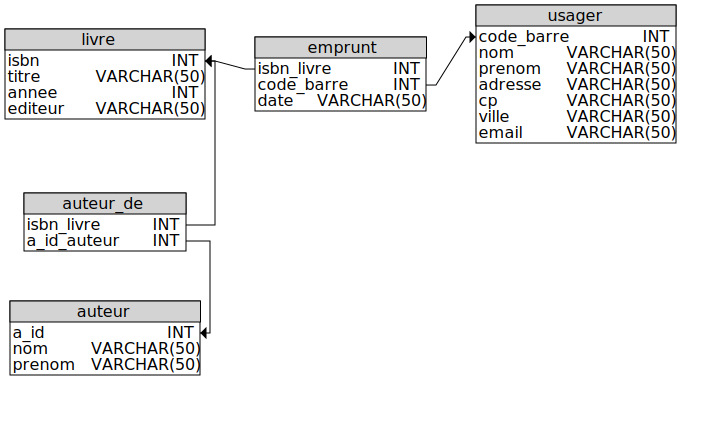

# Ce que peut vérifier le système de gestion de la base de données
## Contraintes de domaine
* A chaque colonne d'une table est associé un **domaine**, qui correspond à
   * un certain **type** : entier, texte, date
   * éventuellement une certaine **taille** : nombre de caractères d'un texte, nombre de bits d'un entier, signe d'un entier
* Lors de chaque insertion, et de chaque modification, ces **contraintes de domaines** sont testées
   * si les valeurs fournies sont "hors domaine", la requête n'est pas exécutée et une erreur est renvoyée
* lors de la conception d'une base de donnée, il est important de bien choisir le domaine défini pour chaque champ (ou colonne).

## Clé primaire : contrainte d'unicité

Essayer la requête : 
* `INSERT INTO auteur VALUES(19, 'Fruchart', 'Thomas');`

Remarquer l'erreur obtenue :  
**Error: UNIQUE constraint failed: auteur.a_id**

Quelques explications s'imposent : 
* il existe dans la table `auteur` une **clé primaire** (identifiée par  : 'PRIMARY')
* cette clé primaire correspond ici au champ (ou colonne):  `a_id`
* pour chaque ligne de la table, la clé primaire doit permettre d'identifier cette ligne de manière **unique**
* ici, la clé primaire  `a_id` permet de s'assurer que deux lignes différentes de la table ne peuvent pas avoir un `a_id` identique!
   * il est donc impossible d'insérer une nouvelle ligne dans la table s'il existe déjà une ligne avec le même isbn
   * il est également impossible de modifier une valeur du champ à_id` sans tenir compte de la contrainte d'unicité.

## Clé étrangère : contrainte de référence
**essayer** les requêtes :

* `INSERT INTO emprunt(code_barre, isbn, retour) VALUES ('123456789012345', '978-0199555918', '2020-12-13');`
* `DELETE FROM usager WHERE code_barre='917547585216771';`

Remarquer les messages d'erreur : 

**`Error: FOREIGN KEY constraint failed`**

Explication :
* la présence d'une clé étrangère sur la table `emprunt` impose une restriction lorsqu'on souhaite ajouter, supprimer ou modifier certaines lignes :
   * si on ajoutait un `emprunt` pour le code-barre 123456789012345...on aurait une incohérence dans la base de données, car ce code-barre ne correspond à aucune ligne dans la table `usager` !
   * si on supprimait de la table `usager` la ligne dont le code-barre '917547585216771'
   * alors une ligne de la table `emprunt` contiendrait une **référence** sans correspondance dans la table `usager`
   * cela reviendrait à supprimer un usager qui n'a pas encore rendu tous les livres empruntés
* l'ajout d'une clé étrangère permet de sécuriser la suppression ou la modification des données, pour préserver la cohérence des données.
* on dit qu'une telle clé étrangère assure une **contrainte d'intégrité** de la base de données.
* lors de la conception d'une base de données, il convient de bien définir les contraintes portant les champs d'une table qui font **référence** à d'autres tables. 
